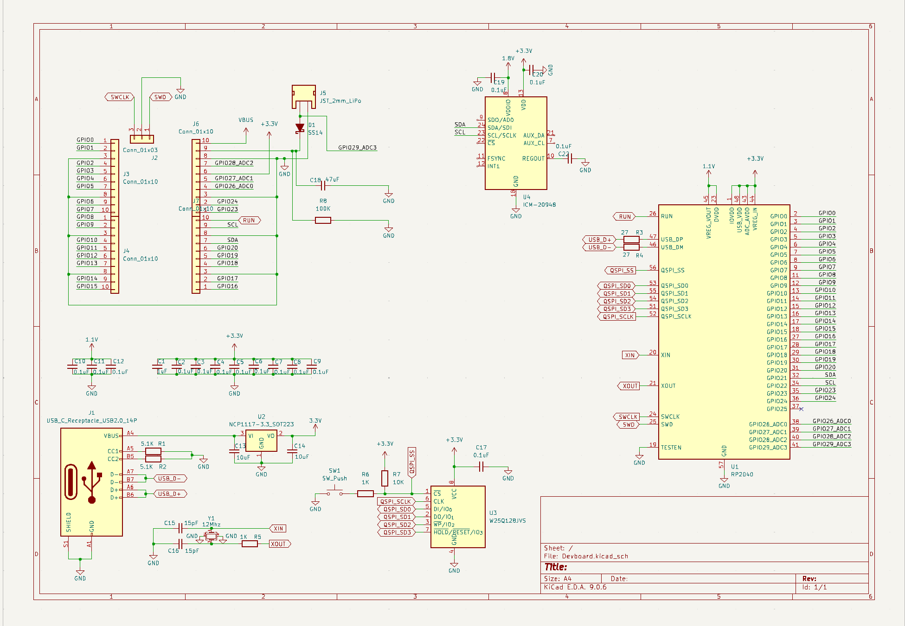

**Total Time: 13.5 hours**

# Completed Schematics - 4 hours
I completed the schematics for the devboard, This is very simple devboard however I do plan to add a bunch of features later on such as an IMU (most likely the MPU-6500) and an Magnetometer as well, I may also try to the robot shoot nerf darts out of its back later on so that will be something I might have to add additional hardware for

Heres a picture of the devboard schematic:

# Completed routing - 5.5 hours
I completed the routing, What I ended up with is a 4 layer board with components on both sides, The reason for having components on both sides is space, by optimizing the space I can reduce the power draw of the robot and speed up reaction time of the devboard, even if it maybe marginal! 
This is why it took 5 hours as I had to do multiple iterations with each iteration getting smaller

heres a picture of the 1st V 2nd iteration:

# Updated Schematics and PCB - 2.5 hours
I updated the schematics to include an IMU which will be used to help balance the robot on the 2 wheels it works by!
I also updated the PCB to be routed with the new IMU and made it so that it now has a silkscreen!

heres a picture of the new board

# I rerouted the PCB and removed the IMU - 1.5 hours

I removed the IMU as I couldn't figure out how to power it, I also realised that having 4 10-pin headers to make 40 pins would be inefficient and instead decided to use 2 20-pin headers to make it easier to route and work on later, I also simplified the board to go from a 4-layer PCB to 2-layer PCB

here is a picture of the board now:

